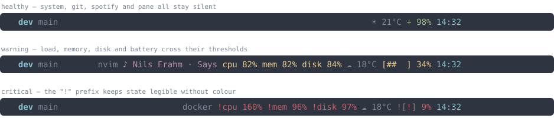

# tmux-useful-status-line

**A tmux status line that's quiet when your machine is fine and loud when it isn't.**

Most status-line plugins shout about every metric all the time — CPU, RAM, disk, battery, weather — each in its own colored block, all competing for attention. Nothing pops because everything pops. This plugin inverts that: routine values stay hidden, color is reserved for state changes, and the bar is calm 95% of the time.



*Rendered from real segment output — `tools/make-screenshot.sh` runs the plugin against
the test fixtures and draws what it emits, so the picture can't drift from the code.
Icons shown are the Nerd-Font-free variants; defaults use Nerd Font glyphs.*

Six segments, each silent until they have something to say.

| Placeholder | Output |
|---|---|
| `#{useful_system}`   | CPU bar / mem% / disk%. Hidden when healthy by default; warn yellow, crit red. |
| `#{useful_battery}`  | Glyph + percent. Color tracks state; charging glyph is distinct. |
| `#{useful_weather}`  | `☁ 7°C` from wttr.in (or verbose with humidity/wind). Dim by default. |
| `#{useful_spotify}`  | Now-playing track. Empty when not playing. Long titles slide once on track change. |
| `#{useful_git}`      | Branch + dirty mark. Empty outside a repo. Warn-color when working tree is dirty. |
| `#{useful_pane}`     | Active pane's command (vim, claude, ssh, …). Hidden for default shells. |
| `#{useful_all}`      | All six at once, from a single process. Cheaper than listing them individually — see [One process instead of six](#one-process-instead-of-six). |

## Install

```tmux
# In ~/.tmux.conf:
set -g @plugin 'ziweiwu/tmux-useful-status-line'
set -g @useful-default-layout on
```

Then `prefix + I` (with [TPM](https://github.com/tmux-plugins/tpm) installed) — you're done.

> **Need a Nerd Font?** Some default glyphs need one. `brew install --cask font-hack-nerd-font`, or set ASCII fallbacks (see [No Nerd Font?](#no-nerd-font)).

### Manual install (no TPM)

```sh
git clone https://github.com/ziweiwu/tmux-useful-status-line ~/.tmux/plugins/tmux-useful-status-line
```

```tmux
run-shell ~/.tmux/plugins/tmux-useful-status-line/useful-status-line.tmux
set -g @useful-default-layout on
```

## Requirements

- tmux 3.0+
- macOS or Linux (system + battery work on both; spotify is macOS-only)
- `curl` for the weather segment (skip otherwise)

Configuration is read in a single tmux round-trip using `#{@user-option}`
format expansion. If your tmux is too old to expand those, the plugin detects
it at startup and falls back to reading each option individually — the same
settings, just a few more subprocesses per refresh. Nothing silently reverts
to defaults.

## Custom layout

If you'd rather hand-author the bar, skip `@useful-default-layout` and write your own:

```tmux
set -g status-interval 30
set -g status-right-length 200
set -g status-right "#{useful_spotify}#{useful_git}#{useful_system}#{useful_weather}#{useful_battery} #[fg=#88c0d0]%H:%M #[default]"
```

> Each segment self-pads with one leading space and emits no trailing space. Don't add your own spaces between `#{useful_*}` placeholders — they'll double up.

To disable a segment without editing your `status-right`:

```tmux
set -g @useful-spotify-enabled  off    # also: -system, -weather, -battery, -git, -pane
```

`#{useful_git}` works in `status-left` too — pairing it with `#{b:pane_current_path}` gives you
"where am I / what branch" in one anchor. See the recipe below.

## One process instead of six

Each `#{useful_*}` placeholder is a separate `#()` shell-out: six bash startups
per status refresh. `#{useful_all}` runs every segment inside one process off
one tmux round-trip instead, and renders identical output.

```tmux
set -g status-right "#{useful_all} #[fg=#88c0d0]%H:%M #[default]"
```

Measured on macOS with a warm cache, four segments, 20 refreshes, CPU time
(wall-clock is too noisy on a loaded machine to compare honestly):

| | tmux subprocesses per refresh | CPU per refresh |
|---|---|---|
| Six separate `#()` placeholders | 31 | ~245 ms |
| Same, batched config (v0.2) | 6 | ~185 ms |
| `#{useful_all}` | 1 | ~115 ms |

For a subset, or to put segments in different places, call the driver directly:

```tmux
set -g status-left  "#[fg=#88c0d0,bold] #S #(~/.tmux/plugins/tmux-useful-status-line/bin/useful-status --segments=git) #[default]"
set -g status-right "#(~/.tmux/plugins/tmux-useful-status-line/bin/useful-status --segments=pane,system,battery)"
```

Two `#()` calls still beat six. The per-segment placeholders remain supported
and unchanged.

## Outside tmux

The segments talk to tmux through exactly three seams — config, pane context,
and colour markup — and all three have non-tmux fallbacks. `bin/useful-status`
is the entry point:

```sh
bin/useful-status --render=ansi     # SGR escapes, for a shell prompt
bin/useful-status --render=plain    # no colour
bin/useful-status --render=json     # for waybar / i3blocks
bin/useful-status --list            # available segment names
bin/useful-status --version
```

It behaves like a CLI should: piping or redirecting drops colour automatically,
`NO_COLOR` is honoured, data goes to stdout and errors to stderr, and a bad
flag exits non-zero. An explicit `--render` always wins over both.

Outside tmux it defaults to `--render=ansi`. Config resolution degrades in one
step rather than all at once:

- **A tmux server is reachable** (even from a terminal that isn't attached to
  it): your `@useful-*` globals are read normally, so a prompt outside tmux and
  a status line inside it stay in sync.
- **No server is reachable**: every option falls back to its default, and the
  `pane` segment renders empty because there is no pane to report on. Nothing
  errors, and no tmux server is started just to answer the query.

Everything else works in both cases.

```sh
# zsh right-prompt, refreshed on each prompt draw
RPROMPT='$(~/.tmux/plugins/tmux-useful-status-line/bin/useful-status --render=ansi --segments=system,battery)'

# starship custom module
[custom.useful]
command = "~/.tmux/plugins/tmux-useful-status-line/bin/useful-status --render=ansi"
when = true
format = "$output"
```

JSON mode reports a severity per segment plus a worst-of `class`, so bar
consumers can style by state:

```json
{"text":"mem 95% disk 85%","class":"critical","segments":[
  {"name":"system","text":"mem 95% disk 85%","severity":"critical"}]}
```

```jsonc
// waybar config
"custom/useful": {
  "exec": "~/.tmux/plugins/tmux-useful-status-line/bin/useful-status --render=json",
  "return-type": "json",
  "interval": 5
}
```

There is no separate config file: tmux options are the only configuration
source, by design. On a host with no tmux at all you get the defaults, which
are chosen to be reasonable unattended. If you need non-default thresholds
there, keep a detached tmux server around (`tmux new-session -d`) with your
`@useful-*` options set — the driver will read them.

## Real-world example

The author's daily-driver config, tuned for running several coding agents in parallel.
Catppuccin Mocha, CPU as a per-core fill bar, thresholds raised because a build box
sitting at 90% CPU is normal, not news.

```tmux
set -g status-interval 30
set -g status-style "bg=#1e1e2e,fg=#cdd6f4"   # Catppuccin Mocha base
set -g status-left-length  80
set -g status-right-length 200

set -g @useful-theme "catppuccin-mocha"

# This machine is busy by design — warn only when load matches core count,
# crit at 1.5x. The stock 70/100 cried wolf during every build.
set -g @useful-system-show-when   "all-always"
set -g @useful-cpu-style          "bar"
set -g @useful-load-warn          100
set -g @useful-load-crit          150
set -g @useful-load-crit-prefix   "none"   # red bar is loud enough without "!"

set -g @useful-weather-format "%c+%C+%t++💧%h++💨%w"

# Left: session · cwd (~ at $HOME) · branch.
set -g status-left "#[fg=#74c7ec,bold] #S #[fg=#6c7086,nobold]│#[fg=default] #{?#{==:#{pane_current_path},#{HOME}},~,#{b:pane_current_path}}#{useful_git} "

# Right: modal cue, then situational, then health, then ambient, then clock.
set -g status-right "#{prefix_highlight}#{useful_pane}#{useful_spotify}#{useful_system}#{useful_weather}#{useful_battery} #[fg=#74c7ec]%H:%M #[fg=#6c7086]%Z #[default]"

# Window list: inactive dim, active sapphire, hairline separator.
setw -g allow-rename off                     # keep OSC titles out of the bar
setw -g automatic-rename-format      "#{pane_current_command}"
setw -g window-status-format         "#[fg=#6c7086] #I:#W#{?window_zoomed_flag,Z,}#{?window_bell_flag,#,} "
setw -g window-status-current-format "#[fg=#74c7ec,bold] #I:#W#{?window_zoomed_flag,Z,} #[default]"
setw -g window-status-separator      "#[fg=#313244]│"
```

Two tmux settings that pair well with `#{useful_pane}` when you keep agents in
background windows — the pane border says *what* each agent is doing, and the bell
flag lights up when a background one finishes:

```tmux
set -g pane-border-status top
set -g pane-border-format " #{?pane_active,#[fg=#74c7ec#,bold],#[fg=#6c7086]}#{pane_title} "
setw -g monitor-bell on
set  -g bell-action  other
set  -g visual-bell  off
```

## Configuration

All options are `set -g @useful-...`. Defaults shown.

### Themes

```tmux
set -g @useful-theme "nord"
```

Available: `nord` *(default)*, `catppuccin-mocha`/`-macchiato`/`-frappe`/`-latte`, `gruvbox`/`-light`, `everforest`, `vitesse`, `rose-pine`/`-dawn`, `tokyo-night`, `dracula`, `solarized-dark`/`-light`, `onedark`. All dim tones pass WCAG AA contrast.

Auto light/dark (Ghostty-style):

```tmux
set -g @useful-theme "dark:catppuccin-mocha,light:catppuccin-latte"
```

Override individual colors (wins over the theme):

```tmux
set -g @useful-color-ok     "#a3be8c"   # also -warn / -crit / -accent / -dim
```

### System (CPU, mem, disk)

```tmux
set -g @useful-system-show-when "warn-and-crit"   # warn-and-crit | mem-and-disk-always | all-always
set -g @useful-cpu-style        "text"            # text ("cpu 70%") | bar ("███▌░░░░░░")
set -g @useful-load-warn 70                       # % of (load1 ÷ ncpu)
set -g @useful-load-crit 100
set -g @useful-mem-warn  75
set -g @useful-mem-crit  90
set -g @useful-disk-warn 80
set -g @useful-disk-crit 95
set -g @useful-load-crit-prefix "!"               # set to "none" to suppress
set -g @useful-mem-crit-prefix  "!"               # ditto
set -g @useful-disk-crit-prefix "!"
```

### Battery

```tmux
set -g @useful-batt-warn       40       # below: warn color (when discharging)
set -g @useful-batt-crit       20       # below: crit color + "!" prefix
set -g @useful-batt-show-when  "always" # always | discharging-or-low | low-only
set -g @useful-batt-icons-ascii off     # "on" → [####] etc., for non-Nerd-Font terminals
set -g @useful-batt-full-pct   95       # at or above: treated as full (full glyph)
```

Individual glyphs: `@useful-batt-icon-full` / `-high` / `-mid` / `-low` / `-empty` / `-charging`.

### Spotify

```tmux
set -g @useful-spotify-max-len   30
set -g @useful-spotify-separator " · "
set -g @useful-spotify-scroll    "on"   # slides through long titles once on track change
set -g @useful-spotify-scroll-dwell    2   # seconds held at the start before sliding
set -g @useful-spotify-scroll-duration 8   # seconds the slide runs before settling
```

`REDUCED_MOTION=1` or `TMUX_USEFUL_REDUCED_MOTION=1` in your env forces scroll off.

### Weather

```tmux
set -g @useful-weather-location ""       # "" = wttr.in geo-IP. e.g. "Toronto", "London,UK", "94103"
set -g @useful-weather-format   "%c+%t"  # condition + temp. Verbose: "%c+%C+%t++💧%h++💨%w"
set -g @useful-weather-refresh  900      # seconds between wttr.in fetches
set -g @useful-weather-stale    3600     # seconds before cached data gets a "~" prefix
```

### Git

```tmux
set -g @useful-git-skip-untracked "off"  # "on" speeds up dirty check in monorepos
set -g @useful-git-dirty-mark     "*"
set -g @useful-git-max-branch-len 24     # longer branches truncate with "…"
```

Detached HEAD shows the short SHA as `@a1b2c3d`.

### Pane

```tmux
set -g @useful-pane-hide    "zsh bash sh fish dash tmux"   # commands to suppress (boring shells)
set -g @useful-pane-max-len 16                             # longer names truncate with "…"
set -g @useful-pane-icon    ""                            # prefix glyph
```

Bare version strings (Claude Code reports its version as `pane_current_command`, e.g. `2.1.126`)
are suppressed automatically.

### Driver

```tmux
set -g @useful-render   tmux    # tmux | ansi | plain | json (default: tmux inside tmux)
set -g @useful-segments "git pane spotify system weather battery"   # order and membership
```

Both apply to `#{useful_all}` / `bin/useful-status`; the `--render` and
`--segments` flags override them.

### Cache directory

Defaults to `${TMPDIR:-/tmp}/tmux-useful-<UID>-<socket-hash>` so multiple servers/users don't collide. Override with `@useful-cache-dir`.

## No Nerd Font?

```tmux
set -g @useful-icon-load        "cpu"      # default; was Nerd Font  before
set -g @useful-icon-mem         "mem"
set -g @useful-icon-disk        "disk"
set -g @useful-batt-icons-ascii "on"       # battery as [####] 92%
set -g @useful-spotify-icon     "♪"
set -g @useful-git-icon         "git"
```

## Troubleshooting

| Symptom | Cause |
|---|---|
| Bar didn't change after install | `status-right` doesn't reference any `#{useful_*}`. Set `@useful-default-layout on` or use the Custom layout snippet. |
| Tofu boxes (□) | Missing Nerd Font — see above. |
| Weather empty | Network down + no cached value, or `@useful-weather-enabled off`. |
| Weather has `~` prefix | Cached data older than 1hr (network probably down). |
| Window shows `0:2.1.119` instead of `0:claude` | OSC title from the running program. Add `setw -g allow-rename off`. |
| Spotify never appears | Spotify not running or paused — empty by design. |

## Uninstall

The plugin mutates `status-left`/`status-right` in place. Removing `@plugin` doesn't revert the running server. Either restart (`tmux kill-server`) or:

```sh
tmux set -gu status-right; tmux set -gu status-left; tmux source-file ~/.tmux.conf
```

## Development

```sh
make check    # shellcheck + 120 bats tests
```

CI runs the matrix on macOS + Ubuntu for every push. See [AGENTS.md](AGENTS.md) for the conventions.

## Sponsor

This plugin is maintained by one person, in evenings, around a full-time job —
and it is MIT licensed for good.

If it has been quietly sitting in your status bar for months,
[sponsorship](https://github.com/sponsors/ziweiwu) is what keeps it maintained
against new tmux releases. One-time is as welcome as monthly.

**Companies:** the $100/month tier includes priority response on issues you file
and your logo here. Invoiced sponsorships available.

## License

MIT
